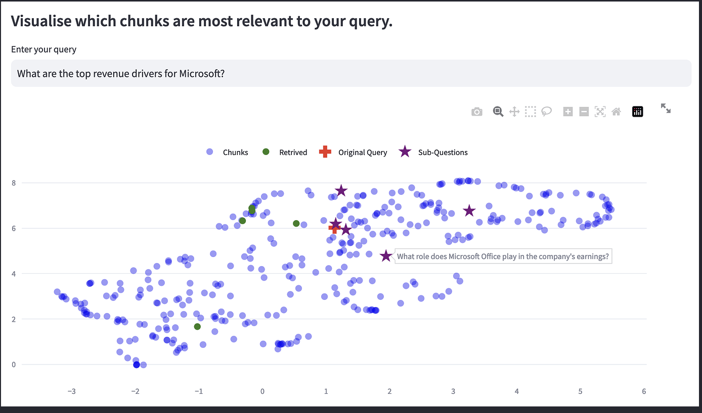

# RAGxplorer

RAGxplorer is an interactive tool for visualizing document chunks in the embedding space, designed to diagnose and explore applications of the Retriever-Answer Generator (RAG) model.



## Overview

RAGxplorer allows users to upload documents, convert them into chunked formats suitable for RAG applications, and visualize these chunks in an embedding space. This visualization aids in understanding how different chunks relate to each other and to specific queries, thereby providing insights into the workings of RAG-based systems.

## Features

- **Document Upload**: Users can upload PDF documents that they wish to analyze.
- **Chunk Configuration**: Options to configure the chunk size and overlap, offering flexibility in how the document is processed.
- **Vector Database Creation**: Builds a vector database from the uploaded document for efficient retrieval and visualization.
- **Query Expansion**: Generates sub-questions and hypothetical answers to enhance the retrieval process.
- **Interactive Visualization**: Utilizes Plotly for dynamic and informative visual representations of the data.

## Modules

- **app.py**: Main Streamlit application file, integrating all components and functionalities.
- **constants.py**: Contains constant values and explanatory texts, especially regarding document chunking.
- **plots.py**: Handles the plotting of data, leveraging Plotly for interactive visualization.
- **query_expansion.py**: Manages query expansion, generating sub-questions and hypothetical answers.
- **rag_utils.py**: Includes utility functions specific to the RAG model, such as building vector databases and handling text splitting.
- **ui.py**: Manages user interface elements of the Streamlit app, focusing on layout and presentation.
- **utils.py**: General utility functions assisting in session state initialization and data frame preparation.

## Installation

To run RAGxplorer, ensure you have Python installed, and then install the necessary dependencies:

```bash
pip install -r requirements.txt
```

## Usage


1. Setup `OPENAI_API_KEY` (required) and `ANYSCALE_API_KEY` (if you need anyscale). Copy
    the `.streamlit/secrets.example.toml` file to `.streamlit/secrets.toml` and fill in the values.
2. To start the application, run:
    ```bash
    streamlit run app.py
    ```

Navigate to the URL provided by Streamlit to interact with the application.

## Contributing

Contributions to RAGxplorer are welcome. Please read our contributing guidelines for details on our code of conduct and the process for submitting pull requests.
License

This project is licensed under the MIT license - see the LICENSE file for details.

## Acknowledgments
- DeepLearning.AI and Chroma for the inspiration and foundational code.
- The Streamlit community for the support and resources.
